# Looop CRM 取扱説明書

このドキュメントは Looop CRM の操作マニュアルです。実際の画面スクリーンショット（[docs/screenshots/](screenshots/)）を見ながら、各機能の使い方と業務の流れを確認できます。

- 対象環境: 本ドキュメントは開発環境（`http://localhost:3000`）のスクリーンショットを使用しています
- 撮影日: 2026-05-13
- 撮影に使用したツール: [agent-browser](https://www.npmjs.com/package/agent-browser)
- 画面サイズ: PC 1440×900 / モバイル 390×844 (iPhone 相当)

---

## 目次

1. [ログインする](#1-ログインする)
2. [画面構成（共通レイアウト）](#2-画面構成共通レイアウト)
3. [顧客一覧で探す・絞り込む](#3-顧客一覧で探す絞り込む)
4. [顧客の詳細を見る](#4-顧客の詳細を見る)
5. [催事現場で新規登録する（モバイル）](#5-催事現場で新規登録するモバイル)
6. [Looop 申込を管理する](#6-looop-申込を管理する)
7. [太陽光連携（CSV 出力）](#7-太陽光連携csv-出力)
8. [クロスセル候補を抽出する](#8-クロスセル候補を抽出する)
9. [売上・明細・返還対象を確認する](#9-売上明細返還対象を確認する)
10. [KPI ダッシュボード](#10-kpi-ダッシュボード)
11. [手数料マスター](#11-手数料マスター)
12. [管理（ユーザー・監査ログ・マスタ・同意文）](#12-管理ユーザー監査ログマスタ同意文)
13. [困ったとき](#13-困ったとき)

---

## 1. ログインする

URL `http://localhost:3000/` にアクセスすると、未ログインの場合は自動的に `/login` にリダイレクトされます。

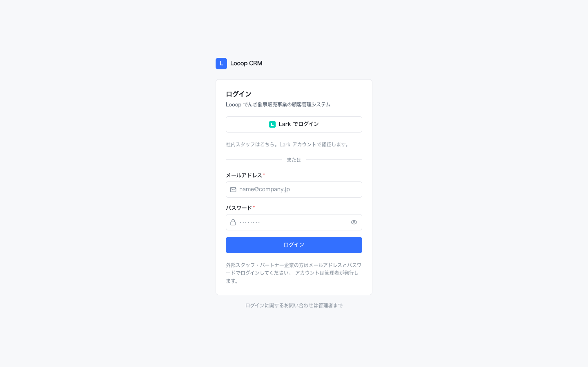

ログイン方法は 2 系統あります。

| 方法 | 対象 | 操作 |
|---|---|---|
| **Lark でログイン** | 社内スタッフ（管理者・マネージャー・現場・CS） | 画面上部の「Lark でログイン」ボタンを 1 回押すだけ |
| **メール + パスワード** | 外部スタッフ・パートナー連携アカウント | メールアドレスとパスワードを入力し「ログイン」 |

> **注意:** 個人情報を扱うシステムです。共有端末で使うときは必ず席を離れる前にログアウト（左サイドバー下部）してください。

---

## 2. 画面構成（共通レイアウト）

ログイン後の管理画面は以下の 3 領域で構成されます。

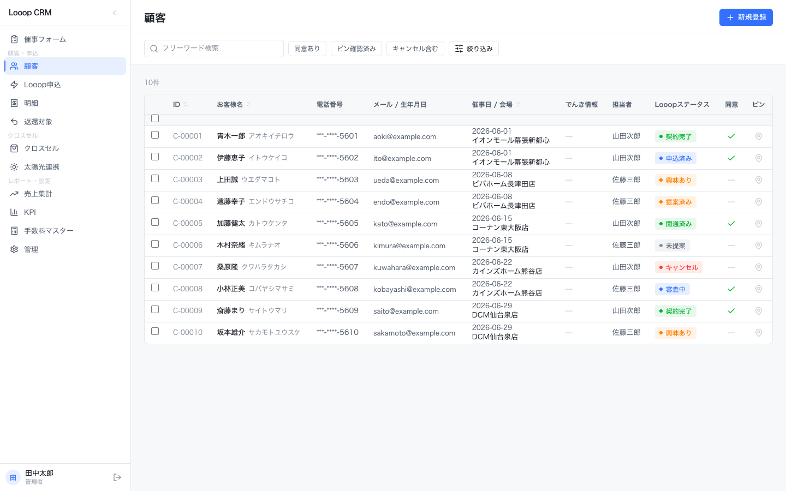

| 領域 | 内容 |
|---|---|
| **左サイドバー（240px）** | メインメニュー。現在の画面はハイライト表示されます |
| **ヘッダ部** | ページタイトル + 右側にプライマリアクション（例: 「新規登録」） |
| **コンテンツ** | フィルタ → テーブル の縦並びが基本構造 |

### サイドバーのメニュー

上から順に下記の 11 項目があります。

- **催事フォーム** — モバイル向け新規登録画面（後述）
- **顧客** — 顧客マスタ一覧（システムの中心）
- **Looop 申込** — 電力契約の申込進捗管理
- **明細** — 課金・支払明細
- **返還対象** — キャンセル等で返還が必要な案件
- **クロスセル** — 太陽光提案候補の抽出
- **太陽光連携** — 提携会社への CSV 出力
- **売上集計** — 月次売上の集計
- **KPI** — ダッシュボード
- **手数料マスター** — 商品ごとの手数料設定
- **管理** — ユーザー・権限・監査ログ・マスタ管理

> 画面上に**プライマリ CTA（青いボタン）は 1 つだけ**置く設計です。「保存」「登録」など主要操作は青、副操作は白ボタンとして並びます。

---

## 3. 顧客一覧で探す・絞り込む

サイドバー「顧客」をクリック、または `/customers` を開きます。


### 上部のコントロール

| 要素 | 用途 |
|---|---|
| **検索ボックス** | 氏名・フリガナ・電話番号・メールでフリーワード検索 |
| **同意あり** トグル | 太陽光提案への同意がある顧客のみ表示 |
| **ピン確認済み** トグル | 住所地図ピンが確認済みの顧客のみ表示 |
| **キャンセル含む** トグル | 通常はキャンセル案件を除外。含めたい時 ON |
| **絞り込み** ボタン | 担当者・会場・期間など詳細フィルタを右サイドシートで開く |
| **新規登録** | PC からの新規顧客登録（通常は催事フォームを使用） |

### テーブルの読み方

列は左から: ID / お客様名 / 電話番号 / メール・生年月日 / 催事日・会場 / でんき情報 / 担当者 / Looop ステータス / 同意 / ピン / 最終更新。

- **電話番号は `***-****-1234` のように下 4 桁のみ表示**（一覧でのマスキング）。フルの番号は詳細画面で確認します（閲覧は監査ログに記録）。
- 列ヘッダのソートマーク付き列をクリックでソート。デフォルトは最終更新の降順。
- 行クリックで詳細画面に遷移します。

### ステータスバッジの色（Looop ステータス列）

| 表示 | 意味 | 色 |
|---|---|---|
| 提案中 / opened / proposed | 提案フェーズ | グレー〜青 |
| 申込済み（applied） | 申込書受領済 | 青 |
| 契約完了（contracted） | 契約処理完了 | 緑 |
| キャンセル | 撤回・解約 | 赤 |

色だけでなく文字でも意味を伝えるため、色覚多様性のあるスタッフでも判別できます。

---

## 4. 顧客の詳細を見る

顧客一覧で行をクリックすると詳細画面が開きます（URL: `/customers/<id>`）。

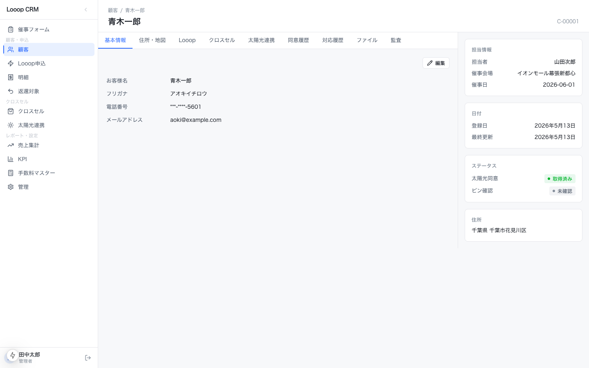

### タブ構成

詳細画面は 9 つのタブで構成されます。

1. **基本情報** — 氏名・連絡先・属性。「編集」ボタンで右サイドシートで編集
2. **住所・地図** — 住所と Google Maps 上のピン確認
3. **Looop** — 電力契約の申込状況・提案履歴
4. **クロスセル** — 太陽光提案候補としての適格性・提案履歴
5. **太陽光連携** — 連携先・連携日時・CSV 出力履歴
6. **同意履歴** — 同意取得日・撤回履歴・同意文 version
7. **対応履歴** — スタッフの対応メモ（タイムライン）
8. **ファイル** — 添付書類
9. **監査** — この顧客に対する操作ログ（管理者のみ閲覧可）

#### 住所・地図タブ

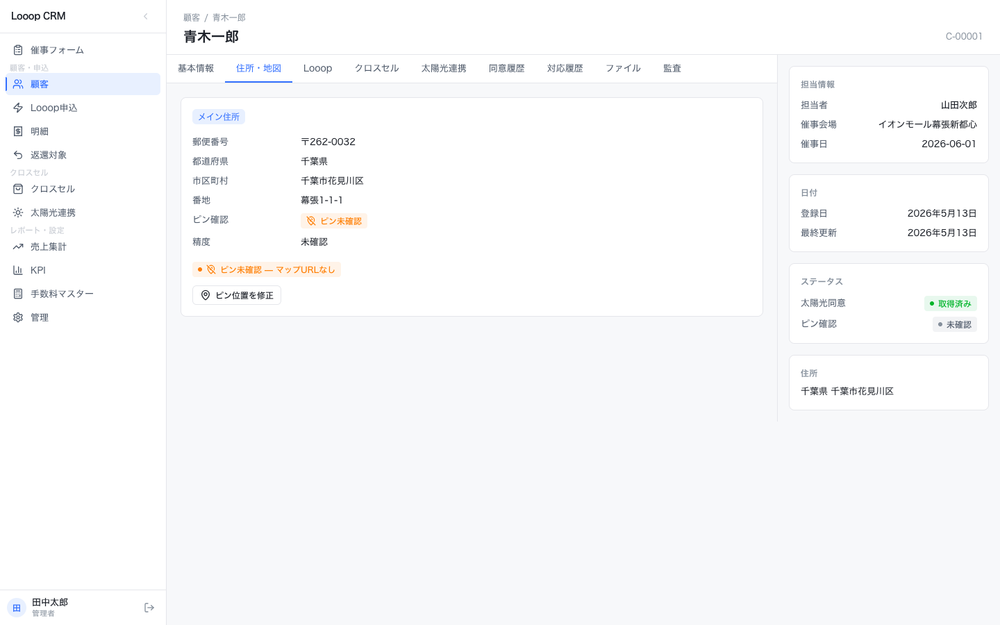

催事現場で取得した住所を Google Maps 上に表示。ピン位置が正しければ右下の「ピン確認済み」をオンにします。**未確認のままでは太陽光連携の CSV 出力対象から除外**されます。

#### Looop タブ

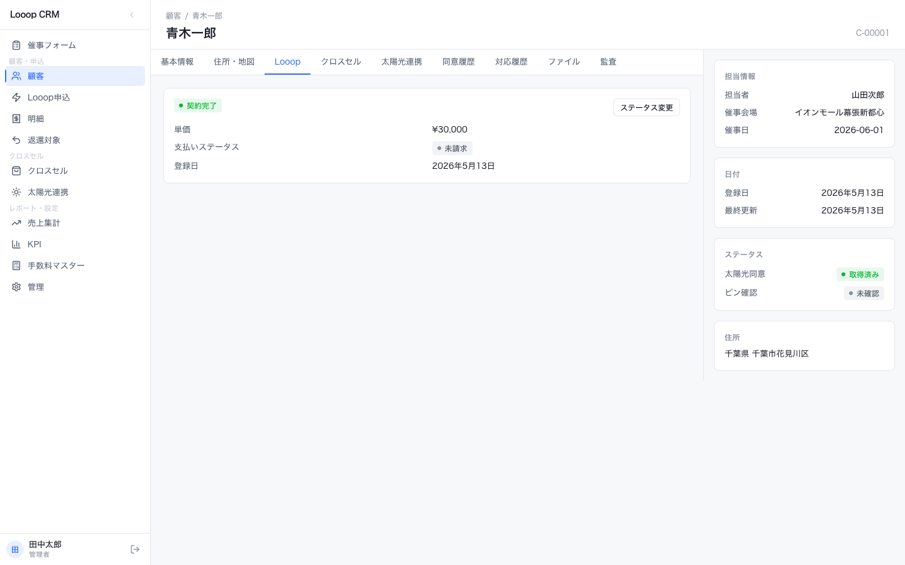

電力申込のステータス遷移・提案単価・売上計上月などを 1 枚で確認できます。

### 右サイドの「編集」シート

「編集」ボタンを押すと、画面を遷移せず**右からスライドインするシート**で編集できます（業務効率のため）。Esc キー・×・背景クリックで閉じます（ただし入力中の背景クリックは誤操作防止のため無効）。

---

## 5. 催事現場で新規登録する（モバイル）

催事会場でスタッフが片手で操作する想定の専用画面です。URL は `/intake`。


### 設計思想

- **3 分以内に 1 件入力できる**ことを KPI として作られています
- ステップ式で、1 ステップは親指の届く範囲に収まる構成
- 入力は自動保存（debounce 1 秒）+ 明示的な「中断する」ボタンの二段構え

### ステップ 1: お客様情報

入力する項目:

- お客様名（必須）
- フリガナ（任意 — 全角カナ自動変換）
- 電話番号（必須 — 半角自動変換、11 桁入力で自動的に次フィールドへ）
- 生年月日（年・月・日のスピンボタン、または「日付選択ツール」）
- メールアドレス（必須）

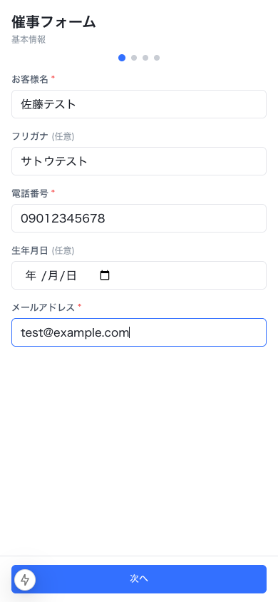

> **🔍 ポイント:** placeholder には実在しない例示しか入れていません（電話番号は `09012345678` のような明らかにダミーの値）。実在しそうな住所などを例示すると誤入力のもとになるためです。

「次へ」で住所入力 → 地図ピン確認 → でんき情報 → 同意取得、と進みます（各ステップで自動保存）。

### 同意の取り扱い

最終ステップでは**同意チェックを 2 つ独立**で取ります（デフォルト OFF）。同意文言は初回展開、二回目以降は折りたたみ可能。

- 同意 1: Looop 電力サービスへの申込同意
- 同意 2: 太陽光提案のための情報提供同意（オプション）

同意 2 が無い顧客は太陽光連携の CSV 出力対象から自動除外され、UI 上でも操作が `disabled` になります。

---

## 6. Looop 申込を管理する

サイドバー「Looop 申込」または `/looop`。

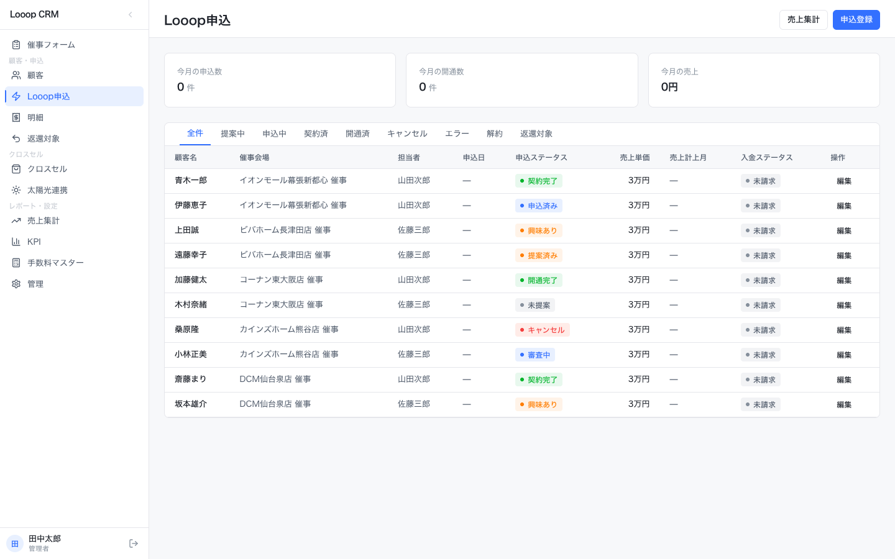

### 上部のステータスタブ

7 種のステータスタブでフィルタできます。

| タブ | 内容 |
|---|---|
| 全件 | フィルタ無し |
| 提案中 | 提案フェーズの顧客 |
| 申込中 | 申込書受領済・処理中 |
| 契約済 | 契約完了 |
| 開通済 | 電力開通完了 |
| キャンセル | 撤回された案件 |
| エラー | 処理エラーで止まっている案件 |
| 解約 | 解約済み |
| 返還対象 | 早期解約等で返還が必要なもの |

### テーブル列

顧客名 / 催事会場 / 担当者 / 申込日 / 申込ステータス / **売上単価** / **売上計上月** / **入金ステータス** / 操作。

数値列（売上単価）は等幅数字（tabular-nums）で右寄せ表示されます。

右上「申込登録」ボタンで PC から手動登録、「売上集計」リンクで関連画面へジャンプ。

---

## 7. 太陽光連携（CSV 出力）

サイドバー「太陽光連携」または `/solar-handoff`。**管理者・マネージャーのみが操作可**。

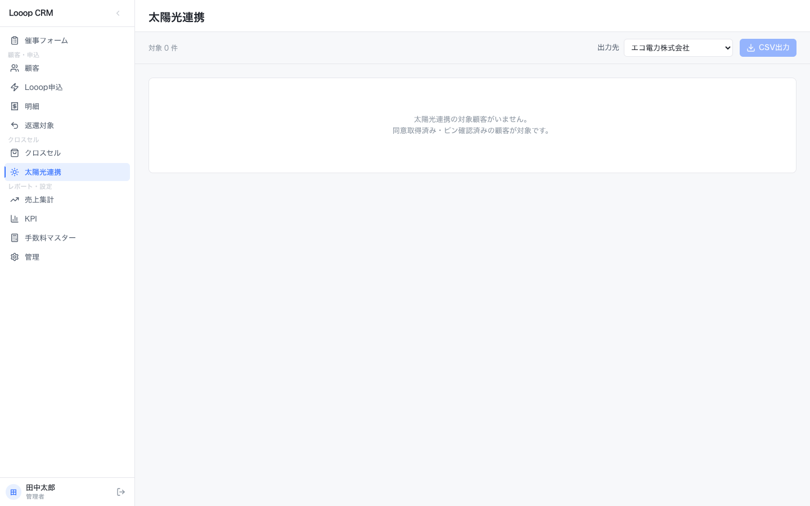

### 操作手順

1. **出力先**プルダウンで提携会社を選択
   - エコ電力株式会社
   - バッテリーテック株式会社
   - 株式会社サンパワー
2. テーブルから対象顧客にチェック（同意なし顧客は選択 disabled、ホバーで理由が tooltip 表示）
3. 「CSV 出力」ボタンを押す
4. 確認ダイアログで以下を確認し最終承認
   - 件数
   - 出力先会社名
   - 同意文 version
5. 出力完了後、トーストで「N 件を CSV 出力しました」と表示され、操作は監査ログに記録されます

> **🔒 セキュリティ:** CSV 出力は同一タブでダウンロード、Blob URL は revoke 済み。出力ボタンは権限の無い人には表示すらされません。

---

## 8. クロスセル候補を抽出する

サイドバー「クロスセル」または `/cross-sell`。

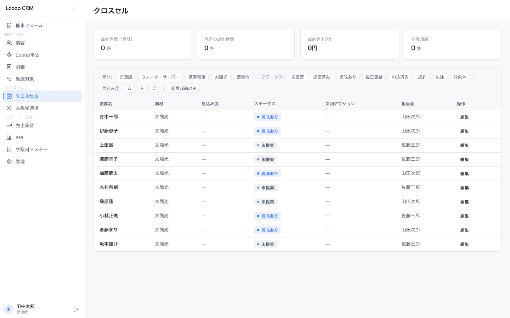

Looop 電力で契約済みの顧客のうち、太陽光提案の見込みがある顧客を抽出する画面です。フィルタ chips で

- 同意の有無
- 過去の提案回数
- 担当者
- 期間

などで絞り込み、優先度順にリスト化します。営業担当者がここから次にコンタクトする顧客を決める運用を想定しています。

---

## 9. 売上・明細・返還対象を確認する

### 売上集計（`/sales`）

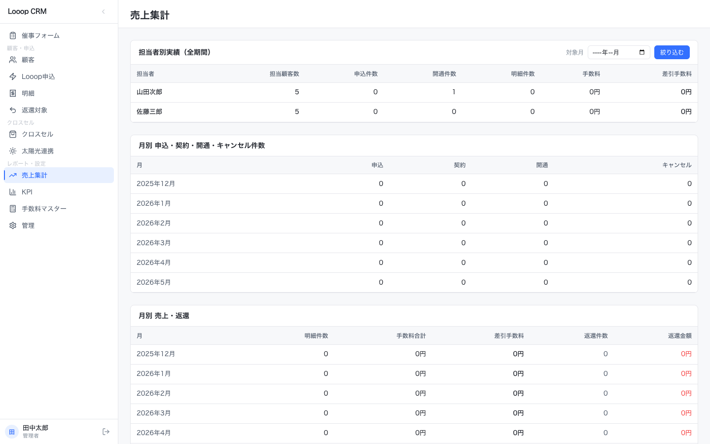

月次・担当者別・会場別の売上集計。手数料マスターと連動して計算されます。

### 明細（`/bills`）

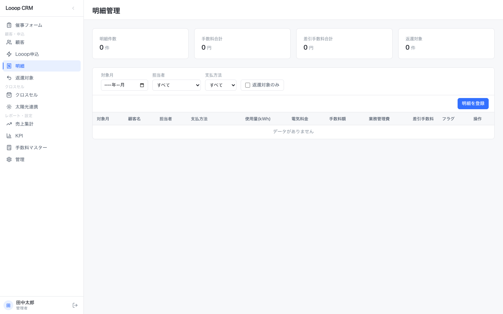

商品ごとの課金・入金明細。1 行 = 1 明細。フィルタで月・ステータスで絞り込み。

### 返還対象（`/refunds`）

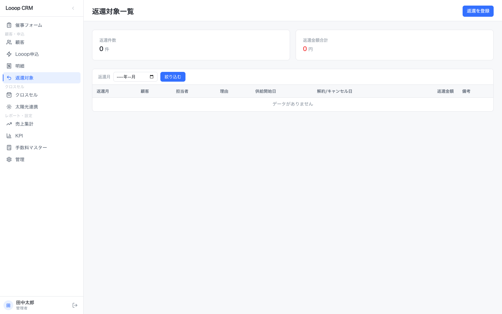

早期解約や請求エラーで返還処理が必要な案件のリスト。経理担当者が**チェック → 返還処理済みフラグ更新**で運用します。

---

## 10. KPI ダッシュボード

サイドバー「KPI」または `/kpi`。

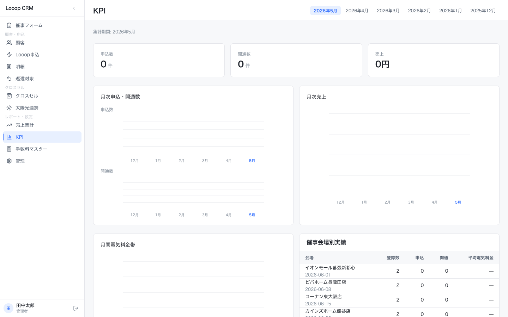

数値カード + シンプルな棒グラフ・スパークラインで構成されます。

- グラフは**単色（ブランドブルー）** + ハイライト 1 色のみ。多色虹色グラフは意図的に採用していません
- 数値は等幅数字で揃えられ、桁ズレなし
- 巨大な数字表示（48px 以上）はせず、業務系として読みやすさを優先

フィルタ操作 or リロードで更新。リアルタイム自動更新はしません（業務集中の妨げを避けるため）。

---

## 11. 手数料マスター

サイドバー「手数料マスター」または `/fee-master`。

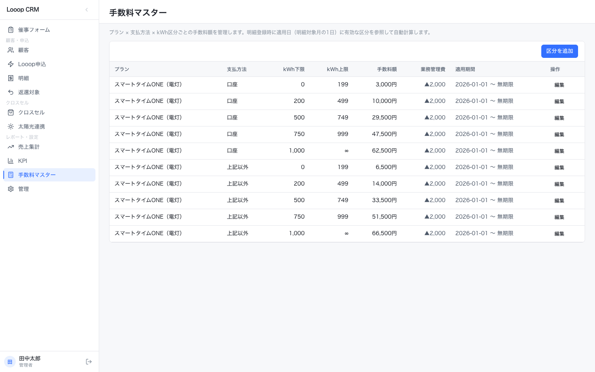

商品（電力プラン等）ごとの手数料を設定する画面。売上集計の計算ベースになります。**変更は監査ログに記録**されるので、いつ誰がどの料率を変更したか追跡できます。

---

## 12. 管理（ユーザー・監査ログ・マスタ・同意文）

サイドバー「管理」または `/admin`。**管理者のみアクセス可**。

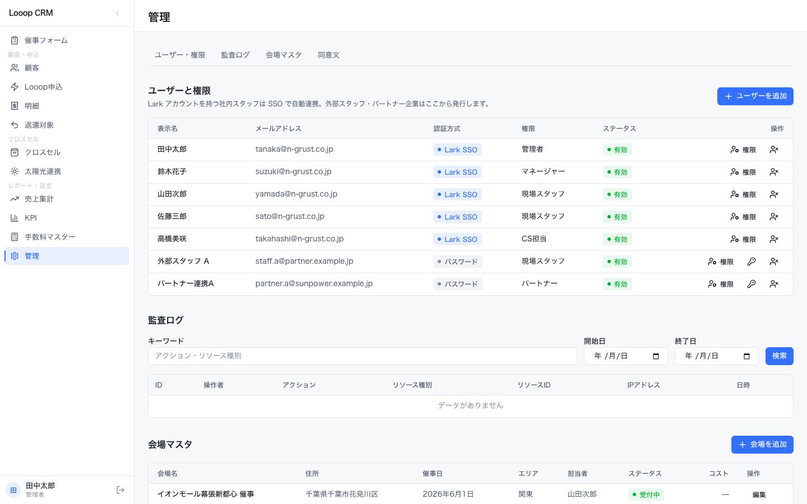

ページ上部のアンカータブで 4 セクションに切り替わります。

### ユーザーと権限

ユーザー一覧表。各行に「権限」「停止する」ボタン。

| 認証方式 | 説明 |
|---|---|
| Lark SSO | Lark アカウントで自動連携。社内スタッフ用 |
| パスワード | メール + パスワードでログイン。外部スタッフ・パートナー用 |

権限ロールは 5 種:

- 管理者（admin）
- マネージャー（manager）
- 現場スタッフ（field）
- CS（cs）
- パートナー（partner）

「ユーザーを追加」ボタンで右サイドシートから新規追加。

### 監査ログ

操作ログを時系列で表示。フィルタ:

- ユーザー
- 操作種別（閲覧 / 編集 / 削除 / CSV 出力 / ログイン）
- 期間

個人情報の閲覧、CSV 出力、削除（論理削除）はすべて自動でログされます。

### 会場マスタ

催事会場の登録・編集。催事フォーム・顧客一覧の「会場」フィルタで使用されます。

### 同意文

同意取得時に表示する文言（version 管理）。同意文を変更すると新しい version になり、過去の同意も version で追跡できます。**過去の同意文を編集することはできません**（法的に必要なため）。

---

## 13. 困ったとき

### ログインできない

- 「Lark でログイン」を選ぶ場合: Lark に先にログインしてから本アプリへアクセスしてください
- パスワードを忘れた場合: 管理者にパスワードリセットを依頼してください（管理画面から実行可）

### 個人情報を見られない / マスクされている

一覧画面では電話番号・住所が**意図的に**マスキングされています。詳細画面（行クリック）でフル表示になります。閲覧は監査ログに記録されます。

### CSV 出力ボタンが押せない

以下のいずれかが原因:

- ログインユーザーに**管理者・マネージャー権限がない** → 管理者に依頼
- 選択した顧客に**同意 2（太陽光提案）がない** → 自動除外、別の顧客を選択
- 選択した顧客の**ピン未確認** → 顧客詳細「住所・地図」タブでピン確認

### 操作を間違えて削除してしまった

本システムでは**「削除」は実際には論理削除（アーカイブ）**です。データは残っています。管理者に依頼すれば復元可能です。完全削除は管理者画面で二段階確認のうえでのみ実行できます。

### 画面が Lark に埋め込まれて表示崩れする

本システムは Lark のカスタムアプリとして iframe 埋め込みされる前提で作られています。Lark のサイドバー・ヘッダと二重にならないよう設計されているため、通常は崩れません。崩れが見られたら以下を確認:

- Lark のバージョンが最新か
- ブラウザのキャッシュをクリアして再度開く
- それでもダメな場合は管理者へ連絡

---

## 付録: スクリーンショットの再撮影

このマニュアルのスクリーンショットは [agent-browser](https://www.npmjs.com/package/agent-browser) で撮影しています。再撮影する場合:

```bash
# dev server を起動
pnpm dev

# 別ターミナルで
agent-browser set viewport 1440 900
agent-browser open http://localhost:3000/customers
agent-browser screenshot docs/screenshots/03-customers.png

# モバイル画面
agent-browser set viewport 390 844
agent-browser open http://localhost:3000/intake
agent-browser screenshot docs/screenshots/06-intake-step1.png

# 終了
agent-browser close
```

`agent-browser snapshot -i` でアクセシビリティツリーが取れるので、画面構造の確認にも便利です。
